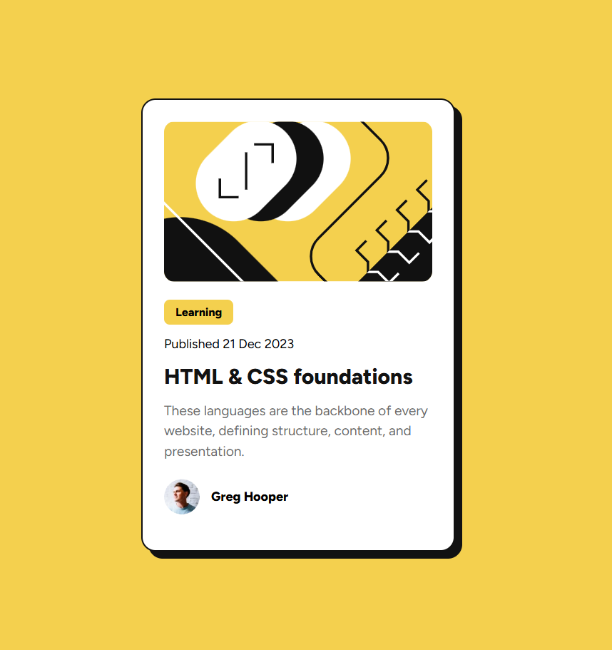

# 📝 Blog Preview Card - Frontend Mentor

## 🔗 Links

* 🔴 Solution URL: https://github.com/your-username/blog-preview-card
* 🟢 Live Site: https://your-project.vercel.app

---

## 📌 General Info

**Solution Title:**
Responsive blog preview card using modern CSS and clamp()

---

## 🛠️ Built with

* CSS Flexbox
* CSS clamp() (fluid responsive design)
* CSS variables
* Semantic HTML
* Mobile-first workflow

---

## 🎯 Features

* Pixel-perfect design
* Hover and focus states
* Fully responsive
* Accessible structure
* SEO-friendly

---

## 🧠 What I learned

* How to use clamp() for responsive design
* Writing semantic HTML
* Improving accessibility
* Basic SEO optimization

---

## ❗ Challenges

* Understanding fluid typography
* Matching Figma design exactly
* Making layout responsive without media queries

---

## 📷 Aperçu

---

## 🙋 Feedback needed

* Advanced accessibility improvements
* CSS performance optimization
* SEO best practices

---
